<p align="center">
  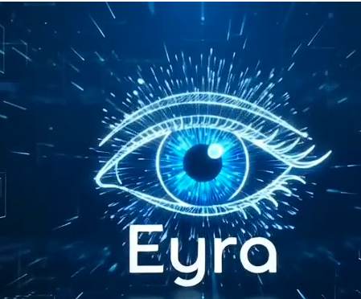
</p>

<h1 align="center">EYRA</h1>

<p align="center">
  <strong>AI-Powered Assistive Vision for Safer, More Independent Mobility</strong>
</p>

<p align="center">
  
  
  
  
  
  
</p>

<p align="center">
  EYRA uses computer vision and real-time audio feedback to help blind and visually impaired users understand obstacles in their surroundings.
</p>

---

## Product Preview

<p align="center">
  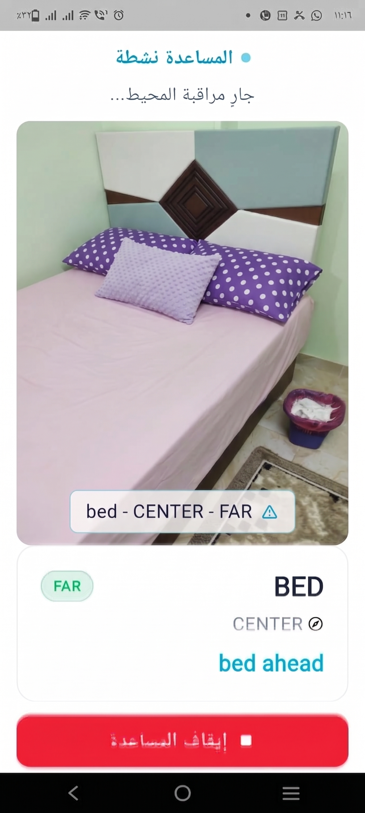
  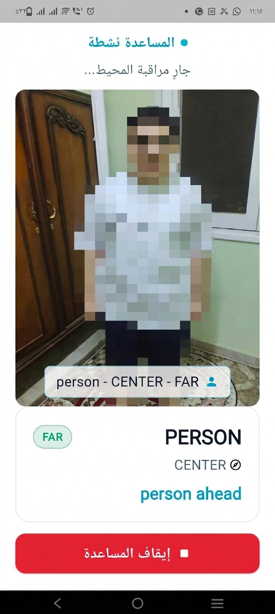
  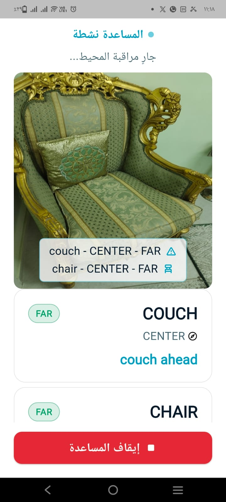
</p>

<p align="center">
  <em>EYRA uses the device camera to analyze the surrounding environment and provide real-time visual detection with audio guidance.</em>
</p>

---

## How It Works

```
Camera Input
     |
     v
 Flutter App
     |
     v
 Image Processing (JPEG / Base64)
     |
     v
 AI Detection API (REST)
     |
     v
 Flask + YOLOv8
     |
     v
 Object Detection Results
     |
     v
 Direction & Distance Interpretation
     |
     v
 Audio Feedback
```

The Flutter application captures camera frames, encodes them, and sends them to the AI detection service via HTTP. The service runs YOLOv8 inference and returns detection results, which the app interprets to provide directional audio alerts.

---

## AI Service

The AI detection backend is built with **Python**, **Flask**, **YOLOv8**, **Ultralytics**, and **OpenCV**.

**Production endpoint:** `https://eyra-rf7w.onrender.com`

| Method | Endpoint | Description |
|--------|----------|-------------|
| `GET` | `/health` | Health check |
| `POST` | `/api/detect` | Object detection |

The detection endpoint accepts camera images and returns object detections with bounding boxes, labels, confidence scores, and original image dimensions.

### Example Response

```json
{
  "detections": [
    {
      "box": [x1, y1, x2, y2],
      "label": "person",
      "conf": 0.85,
      "orig_w": 1280,
      "orig_h": 720
    }
  ],
  "counts": {},
  "total": 1
}
```

---

## AI Service Deployment

The AI detection service is deployed on **Render** and exposes the production API used by the Flutter application.

<p align="center">
  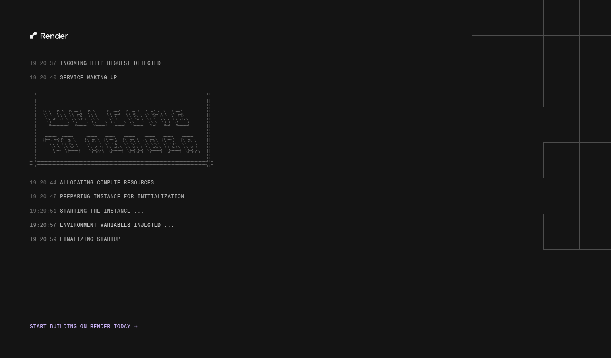
  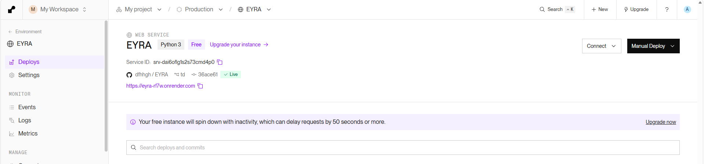
</p>

---

## Features

**Current**

- Real-time camera input
- AI-powered object and obstacle detection
- YOLOv8-based computer vision
- Direction-aware obstacle interpretation
- Approximate distance interpretation
- Audio feedback alerts
- Flutter mobile application
- Cloud-hosted AI detection API
- Production API deployed on Render

**Planned**

- Improved AI detection accuracy
- Reduced incorrect detections
- Faster response speed
- Reduced repeated notifications
- OCR support
- Emergency contacts
- Location sharing
- Expanded real-world testing

---

## Tech Stack

| Layer | Technology |
|-------|------------|
| Mobile | Flutter / Dart |
| Camera | Flutter Camera |
| AI Model | YOLOv8 |
| AI Framework | Ultralytics |
| Backend | Flask |
| Computer Vision | OpenCV |
| API | REST |
| Deployment | Render |

---

## Getting Started

### Flutter App

```bash
cd flutter
flutter pub get
flutter run
```

To connect to the production AI service:

```bash
flutter run --dart-define=AI_BASE_URL=https://eyra-rf7w.onrender.com
```

### AI Service (Development)

```bash
pip install -r requirements.txt
python app.py
```

The Flask service will expose:

- `GET /health`
- `POST /api/detect`

---

## Production API

| | |
|---|---|
| **Base URL** | `https://eyra-rf7w.onrender.com` |
| **Health** | `GET /health` |
| **Detection** | `POST /api/detect` |

The detection endpoint accepts JPEG/base64 image payloads from the Flutter application and returns YOLOv8 detection results.

---

## Project Status

- [x] Flutter mobile application
- [x] Real camera integration
- [x] YOLOv8 object detection
- [x] Flask AI API
- [x] Render deployment
- [x] Audio feedback
- [x] MVP APK
- [x] Initial user validation
- [ ] Google Play release
- [ ] Expanded real-world testing
- [ ] Further AI accuracy optimization

---

## Roadmap

> Planned improvements for future development cycles.

- Improve AI detection accuracy
- Reduce hallucinations and incorrect detections
- Improve response speed
- Reduce unnecessary and repeated notifications
- Expand real-world testing with more users
- OCR support for text recognition
- Emergency contact integration
- Location sharing capabilities
- Further accessibility improvements

---

## Early Validation

EYRA was tested with **5 potential users** during early-stage validation:

- **4 out of 5** users showed interest in the solution and provided feedback
- **1** user did not show interest

The team also started communication with مؤسسة مصر الخير and مركز رعاية المكفوفين في ديروط to better understand the target users and explore collaboration opportunities.

---

## Business Model

- **7-day free trial**
- **299 EGP/month** subscription

---

## Screens

<p align="center">
  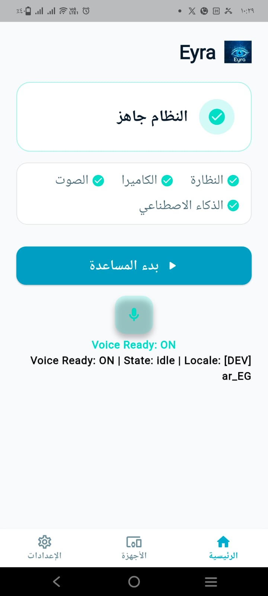
  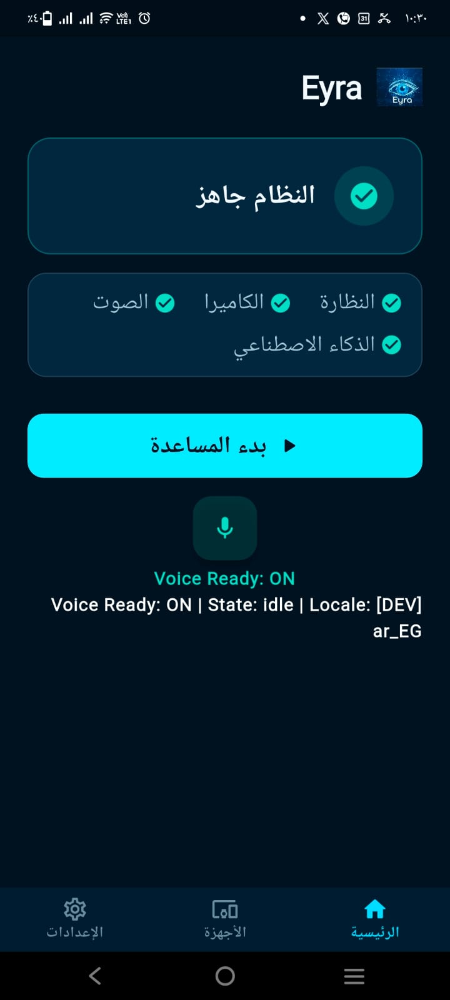
</p>

<p align="center">
  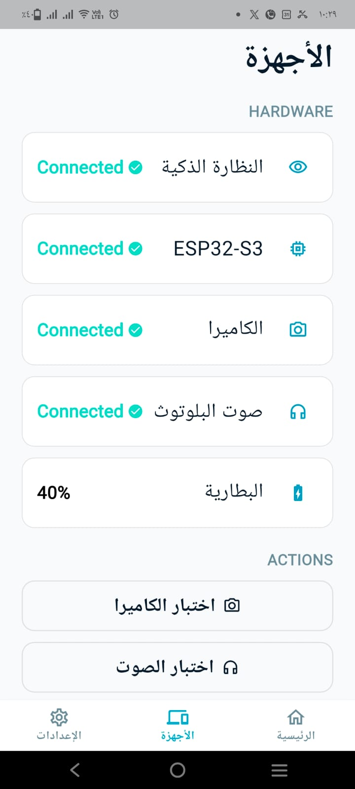
  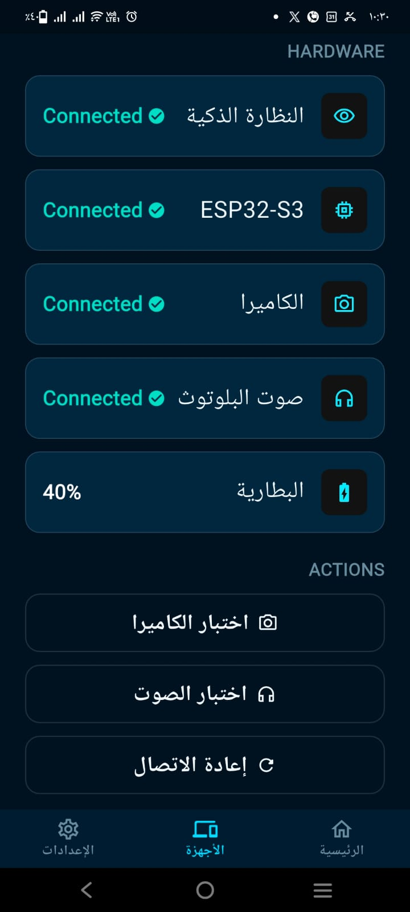
  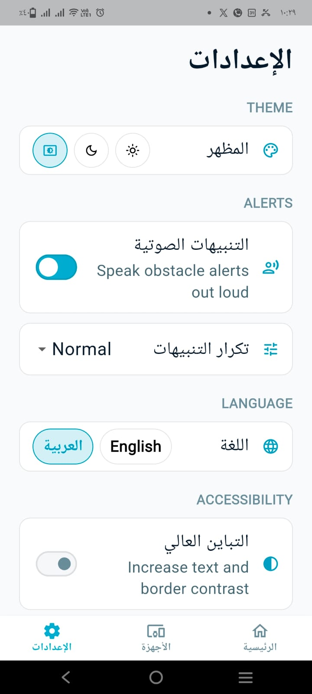
</p>

<p align="center">
  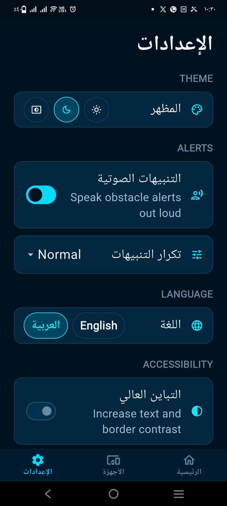
</p>

---

## Team

| Name | Role |
|------|------|
| **Mohammed Emad Hamdy** | Founder & Product Lead / Systems Strategist |
| **Youssef Osama Anwer** | Co-Founder & Lead AI/ML & Computer Vision Engineer |
| **Amir Mohammed Hassan** | Co-Founder & Full-Stack Flutter & Firebase Architect |

---

<p align="center">
  <sub>EYRA is currently under active development as an MVP prototype.</sub>
</p>
